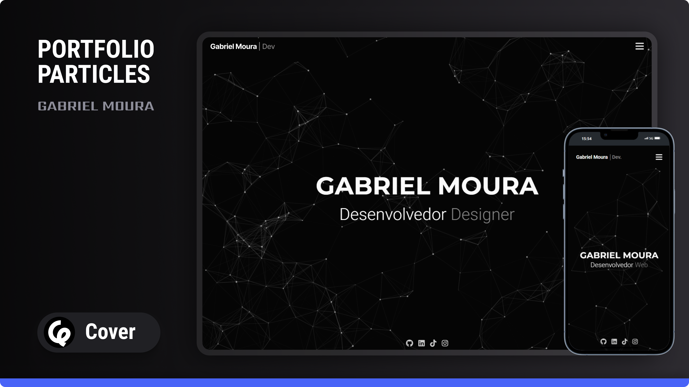

# Gabriel Moura | Desenvolvedor Web

---

## 🚀 Visão Geral do Projeto

Bem-vindo ao repositório oficial do **Portfólio_Particles**, uma aplicação web dinâmica e responsiva projetada para exibir minhas habilidades, projetos e trajetória profissional como Desenvolvedor Web. Este portfólio foi construído com foco em padrões web modernos, experiência do usuário e apelo estético, visando proporcionar aos visitantes um entendimento abrangente das minhas capacidades.

---

<p align="center">
  
</p>

---

## ✨ Funcionalidades

* **Transições Suaves entre Páginas:** Uma animação de carregamento e esmaecimento personalizada garante uma transição fluida entre as páginas, aprimorando a experiência do usuário e evitando carregamentos abruptos.

* **Navegação Responsiva:** Um menu hambúrguer mobile-friendly com animação de "slide-in" oferece navegação intuitiva em diferentes 
dispositivos.

* **Cabeçalho Dinâmico:** O cabeçalho se adapta inteligentemente, fixando-se no topo da tela ao rolar, o que melhora a acessibilidade aos links de navegação.

* **Introdução de Texto Animada:** Uma animação de digitação cativante apresenta aspectos chave da minha expertise na página inicial.


* **Partículas Interativas no Fundo:** Utiliza a biblioteca `particles.js` para criar um fundo visualmente atraente e envolvente na página inicial.

* **Animação do Chevron ao Rolar:** Um chevron animado e sutil orienta os usuários a rolarem a página inicial, desaparecendo assim que a rolagem começa.

* **Pré-carregador com Indicador de Progresso:** Uma tela de carregamento personalizada com contador de porcentagem oferece feedback ao usuário enquanto os recursos da página são carregados.

* **Showcase Detalhado de Projetos:** Seção dedicada para exibir projetos com imagens, descrições, tecnologias utilizadas e links diretos.


* **Depoimentos de Clientes:** Uma seção para destacar feedbacks positivos de clientes.


* **Formulário de Contato:** Um formulário fácil de usar para consultas e comunicação.


* **Integração com Redes Sociais:** Links para diversos perfis profissionais e sociais.


* **Pronto para SEO e Análises:** Inclui meta tags, Google Analytics e Meta Pixel para melhor descoberta e rastreamento.

---

## ⚙️ Tecnologias Utilizadas

* **HTML5:** Para estruturar o conteúdo web.


* **CSS3:** Para estilizar a aplicação, incluindo design responsivo e animações.


* **Propriedades Personalizadas (Variáveis CSS):** Usadas para gerenciar esquemas de cores e outros estilos globais, garantindo consistência e facilidade de manutenção.

* **JavaScript (ES6+):** Para funcionalidades interativas, conteúdo dinâmico e animações.


* **Font Awesome:** Para ícones vetoriais escaláveis.


* **`particles.js`:** Uma biblioteca JavaScript leve para criar fundos de partículas.


* **Google Fonts:** Para tipografia personalizada (`Montserrat` e `Roboto`).

---

## 📂 Estrutura do Projeto

O projeto está organizado em uma estrutura de diretórios clara e lógica:

```
├── assets/
│   ├── css/
│   │   ├── style.css              # Estilo principal
│   │   └── responsivo.css         # Estilo responsivo
│   ├── img/
│   │   └── favicon.ico            # Ícone do site
│   └── js/
│       ├── animaPages.js          # Transição de páginas
│       ├── animaHeader.js         # Cabeçalho fixo
│       ├── animaLoading.js        # Tela de carregamento
│       ├── menu.js                # Menu mobile
│       ├── particles.js           # Partículas animadas
│       └── textoAnimado.js        # Animação de digitação
├── index.html                     # Início
├── about.html                     # Sobre
├── services.html                  # Serviços
├── projects.html                  # Projetos
├── contact.html                   # Contato
└── README.md                      # Documentação do projeto
```

---

## 🚀 Como Começar

Para ter uma cópia local do projeto em funcionamento, siga estes passos simples.

### Pré-requisitos

Você precisa de um navegador web para visualizar o projeto. Nenhum software adicional é necessário para visualização básica.

### Instalação

1.  **Clone o repositório:**
    ```bash
    git clone [https://github.com/G4brielMoura/Portfolio-Particles.git]
    ```
2.  **Navegue até o diretório do projeto:**
    ```bash
    cd seu-repositorio-portfolio
    ```
3.  **Abra o arquivo `index.html` em seu navegador web.** Você pode simplesmente clicar duas vezes no arquivo ou abri-lo através do menu de arquivos do seu navegador.

---

## 💻 Detalhamento do Código

Aqui está uma explicação detalhada das principais funcionalidades JavaScript e do estilo CSS implementados neste projeto:

### Arquivos JavaScript

#### `changePagesAnimation.js`

Este script proporciona uma **transição suave de "fade-out"** ao navegar entre as páginas internas do site, aprimorando a experiência do usuário ao evitar carregamentos bruscos.

* **`DOMContentLoaded` Listener:** Garante que o script seja executado somente após todo o documento HTML ter sido carregado e analisado.


* **Seleção de `body` e `navLinks`:** Seleciona o elemento `<body>` e todos os links de navegação dentro de `.lista-navegacao` para aplicar efeitos de transição. O elemento `.loader` também é selecionado para a animação do pré-carregador.

* **Função `fadeOut(currentUrl)`:**
    * Define a `opacity` do `body` para `0` com uma transição `ease` de `2s`, fazendo com que a página atual desapareça.
    * Aciona uma animação `translateX(0%)` no elemento `.loader`, fazendo com que ele deslize da esquerda, atuando como uma sobreposição durante a transição.
    * Usa `setTimeout` para atrasar o redirecionamento real da página (`window.location.href = currentUrl`) em `500ms`, permitindo que a animação de "fade-out" e do loader sejam visíveis.


* **Função `handleNavLinkActivation(e)`:**
    * Recupera o atributo `href` do link de navegação clicado.
    * **Navegação Condicional:** Previne o efeito de "fade-out" para a página inicial (`index.html`) e links de âncora (`#`), pois estes geralmente envolvem navegação dentro da página ou recarregamentos diretos.
    * `e.preventDefault()`: Interrompe o comportamento padrão do navegador de navegar imediatamente para a nova página, permitindo que a função `fadeOut` personalizada assuma o controle.


* **Listeners de Eventos:** Anexa listeners de eventos `click` e `touchstart` a cada link de navegação, acionando `handleNavLinkActivation` na interação do usuário.


* **`window.addEventListener('load', ...)`:** Define a `opacity` do `body` para `1` quando a página inteira (incluindo todos os recursos como imagens) termina de carregar. Isso proporciona um efeito de "fade-in" inicial para a página.

#### `headerAnimation.js`

Este script gerencia o comportamento do cabeçalho, tornando-o **fixo no topo** quando o usuário rola a página.

* **`scroll` Event Listener:** Escuta o evento `scroll` no objeto `window`.
* **Seleção do `header`:** Obtém o elemento do cabeçalho pelo seu ID.
* **Alternância de Classe Condicional:**
    * Se `window.scrollY` (a posição de rolagem vertical) for maior que `50px`, a classe `header-fixed` é adicionada ao cabeçalho. Esta classe provavelmente contém propriedades CSS para fixar a posição do cabeçalho e, possivelmente, alterar seu fundo ou estilo.
    * Se `window.scrollY` for `50px` ou menos, a classe `header-fixed` é removida, retornando o cabeçalho à sua posição original.

#### `textAnimation.js`

Este script cria um **efeito de digitação e apagamento** para um elemento de texto específico, ciclando através de um array de palavras.

* **Seleção de Elemento e Array de Texto:** Seleciona o elemento `<span>` alvo (`.texto-animado`) e define um array de strings a serem animadas.
* **Variáveis de Tempo:** Define `typingDelay` (atraso de digitação), `erasingDelay` (atraso de apagamento) e `newTextDelay` (novo atraso de texto) para controlar a velocidade da animação.
* **Variáveis de Índice:** `textArrayIndex` mantém o controle da palavra atual em `textArray`, e `charIndex` rastreia o caractere atual sendo digitado ou apagado.
* **Função `type()`:**
    * Verifica se todos os caracteres da palavra atual foram digitados.
    * Adiciona o próximo caractere a `typedTextSpan.textContent`.
    * Chama recursivamente `type()` com um `setTimeout` para o efeito de digitação.
    * Assim que a palavra é totalmente digitada, chama `erase()` após `newTextDelay`.
* **Função `erase()`:**
    * Verifica se restam caracteres para apagar.
    * Remove o último caractere de `typedTextSpan.textContent`.
    * Chama recursivamente `erase()` com um `setTimeout` para o efeito de apagamento.
    * Assim que a palavra é totalmente apagada, incrementa `textArrayIndex` (voltando a `0` se exceder o comprimento do array) e chama `type()` com um atraso para começar a digitar a próxima palavra.
* **Função `init()`:**
    * Inicializa `typedTextSpan` com a primeira palavra e define `charIndex` para seu comprimento.
    * Inicia a animação chamando `erase()` após `newTextDelay`, fazendo com que a primeira palavra apareça imediatamente e então comece a ser apagada.

#### `particles.js`

Este arquivo integra e configura a biblioteca `particles.js`, criando um **fundo de partículas interativo**.

* **`particlesJS("particles-js", {...})`:** Esta é a chamada de função principal da biblioteca `particles.js`. Ela mira o elemento HTML com o ID `particles-js` e aplica a configuração definida.
* **Objeto `particles`:** Define as propriedades das partículas individuais:
    * `number`: Quantidade e densidade de partículas.
    * `color`: Cor das partículas.
    * `shape`: Tipo de partícula (círculo, polígono, imagem).
    * `opacity`: Transparência das partículas.
    * `size`: Tamanho das partículas.
    * `line_linked`: Propriedades das linhas que conectam as partículas (habilitar, distância, cor, opacidade, largura).
    * `move`: Comportamento das partículas (velocidade, direção, movimento aleatório, salto, atração).
* **Objeto `interactivity`:** Define como as partículas reagem à interação do usuário:
    * `detect_on`: Onde as interações são detectadas (canvas).
    * `events`: Eventos como `onhover` (ex: `grab` para conectar partículas) e `onclick` (ex: `push` para adicionar partículas).
    * `modes`: Comportamentos específicos para cada modo interativo (grab, bubble, repulse, push, remove).
* **`retina_detect: true`:** Habilita a detecção de telas retina para renderização em maior resolução.
* **Integração `stats.js` (para desenvolvimento/depuração):** A parte inferior do script inclui `stats.js`, um monitor de desempenho. Isso é tipicamente usado durante o desenvolvimento para verificar taxas de quadros e contagem de partículas. Em um ambiente de produção, esta parte pode ser removida ou comentada.

#### `loadingAnimation.js`

Este script gerencia uma **animação de carregamento em tela cheia** com um contador de porcentagem, fornecendo feedback visual enquanto a página carrega.

* **`DOMContentLoaded` Listener:** Garante que o script seja executado assim que o DOM estiver pronto.
* **Seleção de Elementos:** Seleciona os elementos `#loading-screen` e `#loading-percentage`.
* **Variável `percentage`:** Inicializa um contador para o progresso do carregamento.
* **`loadingInterval`:** Usa `setInterval` para atualizar repetidamente a porcentagem de carregamento.
    * Incrementa `percentage` a cada `10ms`.
    * Atualiza o `innerText` de `#loading-percentage` para exibir a porcentagem atual.
    * Atualiza dinamicamente o `background` de `#loading-screen` para criar um efeito visual de barra de progresso, fazendo a transição de uma cor `var(--blue)` para `var(--black)`.
    * Quando `percentage` atinge `100` ou mais, `clearInterval` interrompe o intervalo, e `loadingScreen.style.display = 'none'` oculta a tela de carregamento, revelando o conteúdo.

#### `menu.js`

Este script lida com a **abertura e fechamento do menu de navegação mobile**.

* **Seleção de Elementos:** Seleciona o `menu-icon` (hambúrguer), `close-icon` e o elemento `menu` (`#menu`).
* **`menuIcon` Click Listener:**
    * Adiciona a classe `open` ao `menu` para torná-lo visível.
    * Adiciona a classe `slide-in` para acionar uma animação CSS para um efeito suave de "slide-in".
* **`closeIcon` Click Listener:**
    * Remove a classe `slide-in` imediatamente.
    * Usa `setTimeout` para remover a classe `open` após `300ms` (correspondendo à duração da transição CSS), garantindo que a animação de "slide-out" seja concluída antes que o menu seja ocultado.

---

### Estrutura HTML (`index.html` e outras páginas)

O HTML segue uma estrutura semântica, com seções claras para `header`, conteúdo `main` e `footer`.

* **Seção `<head>`:**
    * **Meta Tags:** `charset`, `viewport`, `description` para SEO e responsividade.
    * **Favicon:** Link para o favicon do site.
    * **Título:** Título da página para as abas do navegador.
    * **Links CSS:** Links para `style.css` e `responsividade.css`.
    * **Font Awesome:** Link para o CDN de ícones.
    * **CDN do `particles.js`:** Link para a biblioteca `particles.js`.
    * **Scripts de Análise:** Comentários de placeholder para EmailJS, Google Analytics (`gtag.js`) e Meta Pixel, demonstrando uma configuração para rastreamento e serviços externos.
    * **Estilo Inline:** `body { overflow: hidden; }` inicialmente para evitar a rolagem durante a tela de carregamento. Isso provavelmente é sobrescrito por JavaScript assim que a página é carregada.
* **Seção `<body>`:**
    * **`#loading-screen`:** A sobreposição de carregamento inicial com `#loading-percentage`.
    * **`.loader`:** Outro elemento de pré-carregador usado para transições de página.
    * **`<header>` (`#header`):**
        * `.container-header`: Contém o logotipo e os ícones do menu.
        * `.logo`: Título do site com um destaque em um span.
        * `.menu-icon`: Ícone de hambúrguer para navegação mobile.
        * `#menu` (`.menu-navegacao`): O menu de navegação principal, inicialmente oculto.
        * `.close-icon`: Botão de fechar para o menu mobile.
        * `.lista-navegacao`: Lista não ordenada de links de navegação.
    * **`<main>` (`#home`):** A área de conteúdo principal da página inicial.
        * `#particles-js`: O elemento canvas para o fundo de partículas.
        * `.container-home`: Contém o texto principal e os links de redes sociais.
        * `.text-home`: Título e texto animado dinamicamente.
        * `.redes-sociais`: Ícones de redes sociais.
    * **Tags `<script>`:** Links para todos os arquivos JavaScript personalizados no final do `<body>` para otimizar o desempenho de carregamento.

---

### Estilização CSS (`style.css` e `responsividade.css`)

O CSS define a apresentação visual, o layout e as animações.

#### `style.css` (Destaques Principais)

* **Importação de Fontes:** Importa `Montserrat` e `Roboto` do Google Fonts.
* **`loader`:**
    * `position: fixed; top: 0; left: 0; width: 100%; height: 100%;`: Sobreposição em tela cheia.
    * `background-color: blueviolet;`: A cor do loader.
    * `transform: translateX(-100%);`: Inicialmente fora da tela para a esquerda.
    * `transition: transform 0.5s ease-in-out;`: Animação suave de "slide-in".
    * `z-index: 999999;`: Garante que esteja acima de tudo.
* **`#loading-screen`:**
    * `position: fixed; top: 0; left: 0; width: 100%; height: 100%;`: Sobreposição em tela cheia.
    * `background-color: var(--black);`: Cor de fundo inicial.
    * `display: flex; justify-content: center; align-items: center;`: Centraliza o texto da porcentagem.
    * `z-index: 9999;`: Alto z-index para cobrir o conteúdo.
* **`#loading-percentage`:** Estilos para o texto da porcentagem de carregamento.
* **Estilos Globais (`*`, `a`, `li`):** Redefine margens, preenchimentos, `box-sizing` e estilos padrão de links/listas.
* **Personalização da Barra de Rolagem:** Estilos para as barras de rolagem webkit.
* **Variáveis CSS (`:root`):** Define `--blue`, `--black`, `--white`, `--gray` para fácil tematização e consistência.
* **`body`:** Define a família da fonte, fundo, cor do texto, preenchimento e `overflow-x: hidden` para evitar rolagem horizontal.
* **`#particles-js`:** Posiciona corretamente o fundo de partículas.
* **`.header` e `.header-fixed`:**
    * `.header`: Estilos base para o cabeçalho.
    * `.header-fixed`: Aplica `position: fixed`, `background-color` com `rgba` para transparência e um `z-index` mais alto quando rolado.
* **`.menu-navegacao`:**
    * `position: fixed; right: -100%; opacity: 0;`: Inicialmente fora da tela e transparente para a animação de "slide-in"/"fade-in".
    * `transition: right 0.3s ease-out, opacity 0.3s ease-out;`: Define a transição para abrir/fechar o menu.
    * As classes `.open` e `.slide-in` são adicionadas pelo JavaScript para controlar a visibilidade e a animação do menu.
* **`.chevron-down`:**
    * `position: absolute; bottom: 10px; left: 50%; transform: translateX(-50%);`: Posiciona o chevron no centro inferior.
    * `transition: opacity 0.4s ease-out; opacity: 0;`: Inicialmente oculto, aparece gradualmente.
    * `@keyframes bounce`: Define a animação de salto vertical para o chevron.
* **`.card-service` e `.item` (Card de Depoimento):**
    * `background-color: #151515; border-radius: 25px;`: Estilo comum para os cards.
    * **Efeitos de Hover:** Inclui transições de `box-shadow` no hover para ícones (`.card-service i`) e imagens (`.item img`), criando um efeito de "preenchimento".
* **`.card-tech` (Ícones de Habilidades):**
    * Inclui `transform: translateY(-5px);` no hover para um efeito de elevação.
    * Efeitos de `filter` sofisticados no hover para ícones de tecnologia (`img[data-tech="..."]`), alterando sua cor para corresponder às cores típicas das marcas.

#### `responsividade.css` (Não fornecido, mas assumido)

Este arquivo conteria media queries para ajustar o layout e os estilos para diferentes tamanhos de tela (por exemplo, mobile, tablet, desktop). Com base no JavaScript para o menu mobile e na estrutura geral, fica claro que o design pretende ser responsivo. Pontos de interrupção típicos ajustariam tamanhos de fonte, layouts flexbox/grid e visibilidade de elementos.

---

### 🔗 Acesse o Projeto Online

Você pode visualizar o projeto funcionando aqui:

👉 [Clique para ver o projeto online](https://cakelovers.github.io/meu-site)

## 🤝 Contribuição

Sinta-se à vontade para fazer um "fork" deste repositório, realizar alterações e enviar "pull requests". Todas as contribuições, sugestões ou melhorias são bem-vindas!

1.  Faça um "Fork" do Projeto
2.  Crie sua Branch de Recurso (`git checkout -b feature/NovaFuncionalidadeIncrivel`)
3.  Faça o Commit das suas Alterações (`git commit -m 'Adiciona alguma NovaFuncionalidadeIncrivel'`)
4.  Envie para a Branch (`git push origin feature/NovaFuncionalidadeIncrivel`)
5.  Abra um Pull Request

---

## 📄 Licença

Esse projeto está sob a licença [MIT](./LICENSE).  
<a href="./LICENSE">
  
</a>

---

## 📞 Contato

<p align="center">
  <a href="https://www.linkedin.com/in/gabriel-moura-dev/" target="_blank">
    
  </a>
  <a href="https://github.com/G4brielMoura" target="_blank">
    
  </a>
  <a href="https://www.instagram.com/gabrielmoura_dev/" target="_blank">
    
  </a>
</p>

---


